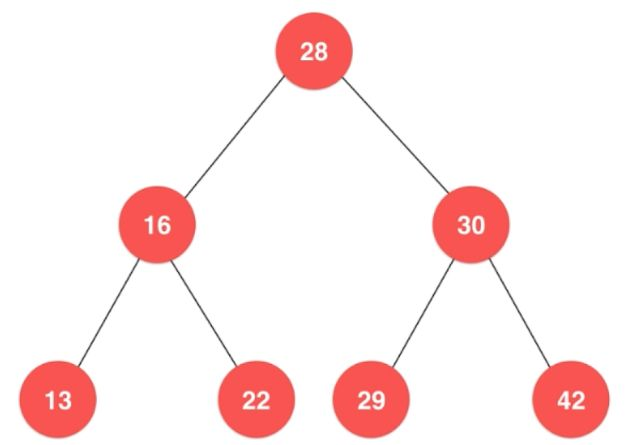
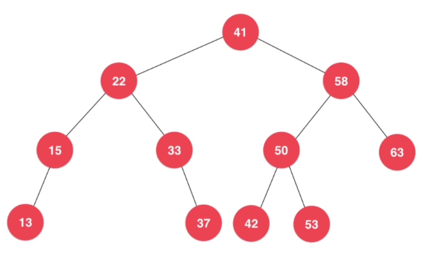
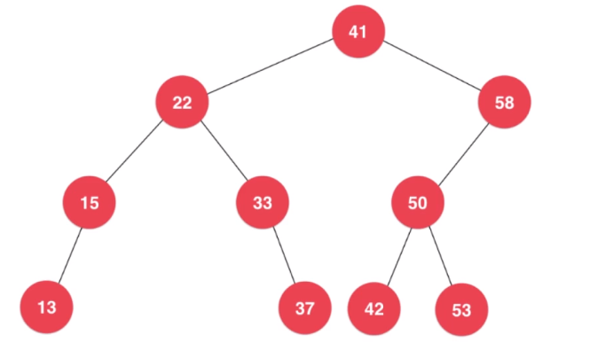
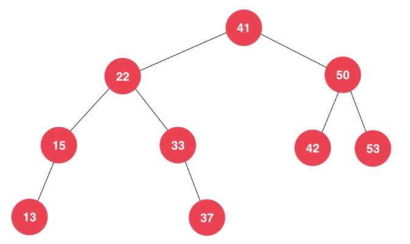
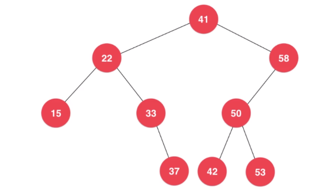
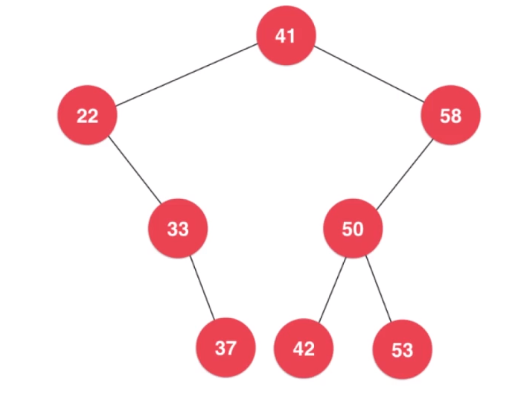
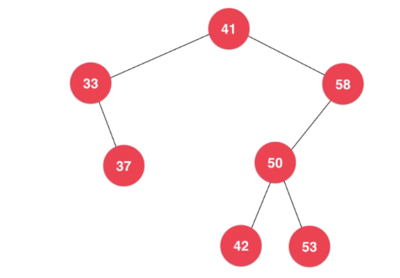
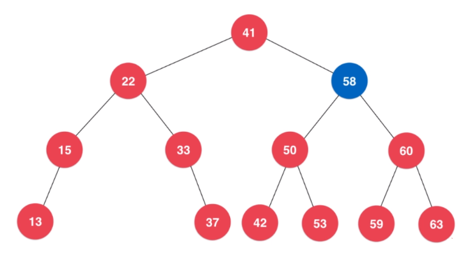
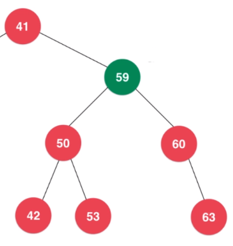

# 二分搜索树

## 满足的条件

1. 每个节点都大于它的左孩子, 小于它的右孩子
2. 每个节点的左子树和右子树都是二分搜索树
3. 不一定是完全二叉树



## 插入新节点

例: 节点20) 首先和根节点28比较, 20小于28, 插入到28的左子树中。
因为28有左节点, 所以再和16比较, 20大于16, 插入到16的右子树中。
因为16有右节点, 所以再和22比较, 20小于22, 插入到22的左子树中。
由于22没有左节点, 所以20作为22的左节点插入到二叉树中。
操作完成。

 ## 查找
 
例: 查找15) 首先和根节点28比较, 15小于28, 去28的左子树中查找。
和16比较, 15小于16, 在16的左子树中查找。
和13比较, 15大于13, 在13的右子树中查找。
由于13没有右节点, 查找结束, 没有找到匹配的节点。
操作完成。

## 遍历 O(n)

### 深度优先遍历


沿绿色箭头遍历整个二叉树(从from开始, 到to完成遍历)。在遍历的过程中每个节点被访问到3次, 按被访问到的先后分成了\[前, 中, 后\]。

#### 前序遍历

遍历时到'前'的位置时做操作(例: 输出节点), 在'中'和'后'的位置不做操作。

遍历完成后输出的结果为: 28, 16, 13, 22, 30, 29, 42

#### 中序遍历

遍历时到'中'的位置时做操作(例: 输出节点), 在'前'和'后'的位置不做操作。

遍历完成后输出的结果为: 13, 16, 22, 28, 29, 30, 42 (结果是升序排列的)

#### 后序遍历

遍历时到'后'的位置时做操作(例: 输出节点), 在'前'和'中'的位置不做操作。

遍历完成后输出的结果为: 13, 22, 16, 29, 42, 30, 28 (可以用来释放二叉树的空间, 在两棵子树都释放后再释放父节点)

### 广度优先遍历

使用队列辅助

首先将根节点28入队, 然后开始循环。

将队首元素出队做操作(例: 输出节点), 然后将它的左右子节点入队。
如果队列不为空继续循环, 如果队列为空结束循环遍历完成。

遍历完成后输出的结果为: 28, 16, 30, 13, 22, 29, 42

## 最小值

从根节点开始一直寻找左子节点, 直到左子节点为null的节点就是最小的节点。

## 最大值

从根节点开始一直寻找右子节点, 直到右子节点为null的节点就是最小的节点。

## 删除最大值和最小值

### 删除最大值



最大值是63, 直接删除



现在最大值是58, 删除后将左子树的根节点50代替被删除的节点58



### 删除最小值



最小值是15, 直接删除



现在最大值是22, 删除后将右子树的根节点33代替被删除的节点22



## 删除节点



找到节点58的右子树中的最小值59, 用59代替58。



```
// 二分搜索树
// 由于Key需要能够进行比较, 所以需要extends Comparable<Key>
public class BST<Key extends Comparable<Key>, Value> {

    // 树中的节点
    private class Node {
        private Key key;
        private Value value;
        private Node left, right;

        public Node(Key key, Value value) {
            this.key = key;
            this.value = value;
            left = right = null;
        }

        public Node(Node node){
            this.key = node.key;
            this.value = node.value;
            this.left = node.left;
            this.right = node.right;
        }
    }

    private Node root;  // 根节点
    private int count;  // 树的节点个数

    // 构造函数, 默认构造一棵空二分搜索树
    public BST() {
        root = null;
        count = 0;
    }

    // 返回二分搜索树的节点个数
    public int size() {
        return count;
    }

    // 返回二分搜索树是否为空
    public boolean isEmpty() {
        return count == 0;
    }

    // 向二分搜索树中插入一个新的节点
    public void insert(Key key, Value value){
        root = insert(root, key, value);
    }

    // 查看二分搜索树中是否存在键key
    public boolean contain(Key key){
        return contain(root, key);
    }

    // 在二分搜索树中搜索键key所对应的值。如果这个值不存在, 则返回null
    public Value search(Key key){
        return search( root , key );
    }

    // 二分搜索树的前序遍历
    public void preOrder(){
        preOrder(root);
    }

    // 二分搜索树的中序遍历
    public void inOrder(){
        inOrder(root);
    }

    // 二分搜索树的后序遍历
    public void postOrder(){
        postOrder(root);
    }

    // 二分搜索树的层序遍历
    public void levelOrder(){

        // 我们使用LinkedList来作为我们的队列
        LinkedList<Node> q = new LinkedList<Node>();
        q.add(root);
        while( !q.isEmpty() ){

            Node node = q.remove();

            System.out.println(node.key);

            if( node.left != null )
                q.add( node.left );
            if( node.right != null )
                q.add( node.right );
        }
    }

    // 寻找二分搜索树的最小的键值
    public Key minimum(){
        assert count != 0;
        Node minNode = minimum( root );
        return minNode.key;
    }

    // 寻找二分搜索树的最大的键值
    public Key maximum(){
        assert count != 0;
        Node maxNode = maximum(root);
        return maxNode.key;
    }

    // 从二分搜索树中删除最小值所在节点
    public void removeMin(){
        if( root != null )
            root = removeMin( root );
    }

    // 从二分搜索树中删除最大值所在节点
    public void removeMax(){
        if( root != null )
            root = removeMax( root );
    }

    // 从二分搜索树中删除键值为key的节点
    public void remove(Key key){
        root = remove(root, key);
    }

    //********************
    //* 二分搜索树的辅助函数
    //********************

    // 向以node为根的二分搜索树中, 插入节点
    // 返回插入新节点后的二分搜索树的根
    private Node insert(Node node, Key key, Value value){

        if( node == null ){
            count ++;
            return new Node(key, value);
        }

        if( key.compareTo(node.key) == 0 )
            node.value = value;
        else if( key.compareTo(node.key) < 0 )
            node.left = insert( node.left , key, value);
        else    // key > node->key
            node.right = insert( node.right, key, value);

        return node;
    }

    // 查看以node为根的二分搜索树中是否包含键值为key的节点
    private boolean contain(Node node, Key key){

        if( node == null )
            return false;

        if( key.compareTo(node.key) == 0 )
            return true;
        else if( key.compareTo(node.key) < 0 )
            return contain( node.left , key );
        else // key > node->key
            return contain( node.right , key );
    }

    // 在以node为根的二分搜索树中查找key所对应的value
    // 若value不存在, 则返回NULL
    private Value search(Node node, Key key){

        if( node == null )
            return null;

        if( key.compareTo(node.key) == 0 )
            return node.value;
        else if( key.compareTo(node.key) < 0 )
            return search( node.left , key );
        else // key > node->key
            return search( node.right, key );
    }

    // 对以node为根的二叉搜索树进行前序遍历
    private void preOrder(Node node){

        if( node != null ){
            System.out.println(node.key);
            preOrder(node.left);
            preOrder(node.right);
        }
    }

    // 对以node为根的二叉搜索树进行中序遍历
    private void inOrder(Node node){

        if( node != null ){
            inOrder(node.left);
            System.out.println(node.key);
            inOrder(node.right);
        }
    }

    // 对以node为根的二叉搜索树进行后序遍历
    private void postOrder(Node node){

        if( node != null ){
            postOrder(node.left);
            postOrder(node.right);
            System.out.println(node.key);
        }
    }

    // 返回以node为根的二分搜索树的最小键值所在的节点
    private Node minimum(Node node){
        if( node.left == null )
            return node;

        return minimum(node.left);
    }

    // 返回以node为根的二分搜索树的最大键值所在的节点
    private Node maximum(Node node){
        if( node.right == null )
            return node;

        return maximum(node.right);
    }

    // 删除掉以node为根的二分搜索树中的最小节点
    // 返回删除节点后新的二分搜索树的根
    private Node removeMin(Node node){

        if( node.left == null ){

            Node rightNode = node.right;
            node.right = null;
            count --;
            return rightNode;
        }

        node.left = removeMin(node.left);
        return node;
    }

    // 删除掉以node为根的二分搜索树中的最大节点
    // 返回删除节点后新的二分搜索树的根
    private Node removeMax(Node node){

        if( node.right == null ){

            Node leftNode = node.left;
            node.left = null;
            count --;
            return leftNode;
        }

        node.right = removeMax(node.right);
        return node;
    }

    // 删除掉以node为根的二分搜索树中键值为key的节点
    // 返回删除节点后新的二分搜索树的根
    Node remove(Node node, Key key){

        if( node == null )
            return null;

        if( key.compareTo(node.key) < 0 ){
            node.left = remove( node.left , key );
            return node;
        }
        else if( key.compareTo(node.key) > 0 ){
            node.right = remove( node.right, key );
            return node;
        }
        else{   // key == node->key

            // 待删除节点左子树为空的情况
            if( node.left == null ){
                Node rightNode = node.right;
                node.right = null;
                count --;
                return rightNode;
            }

            // 待删除节点右子树为空的情况
            if( node.right == null ){
                Node leftNode = node.left;
                node.left = null;
                count--;
                return leftNode;
            }

            // 待删除节点左右子树均不为空的情况

            // 找到比待删除节点大的最小节点, 即待删除节点右子树的最小节点
            // 用这个节点顶替待删除节点的位置
            Node successor = new Node(minimum(node.right));
            count ++;

            successor.right = removeMin(node.right);
            successor.left = node.left;

            node.left = node.right = null;
            count --;

            return successor;
        }
    }
}
```
