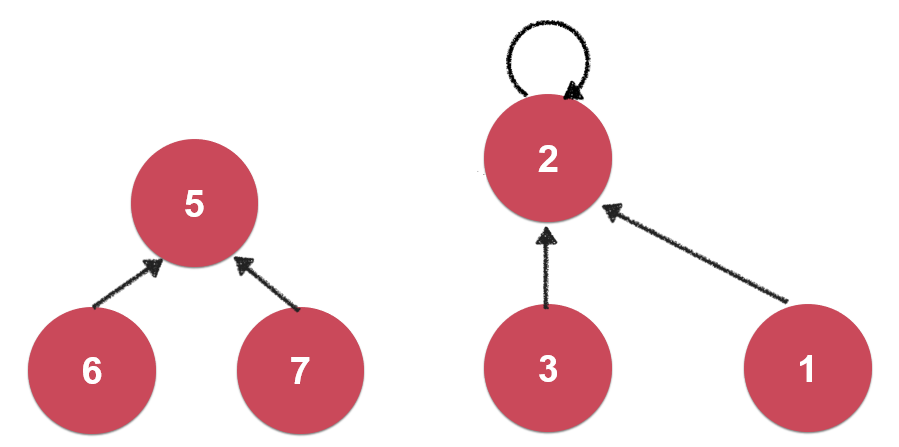
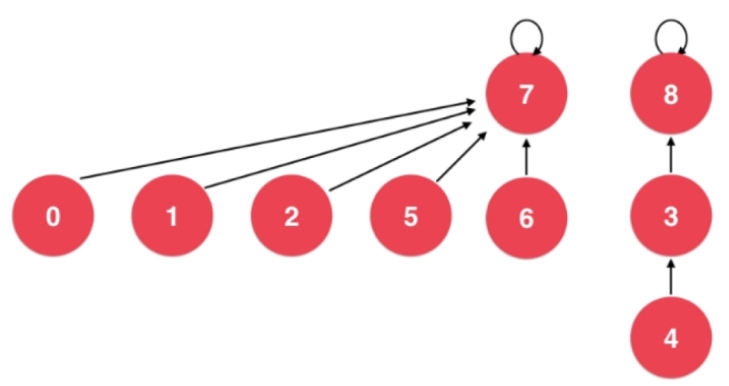
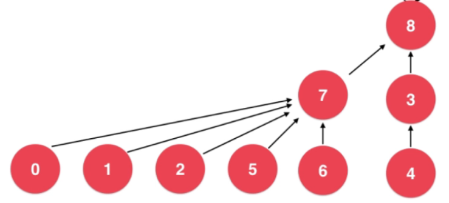
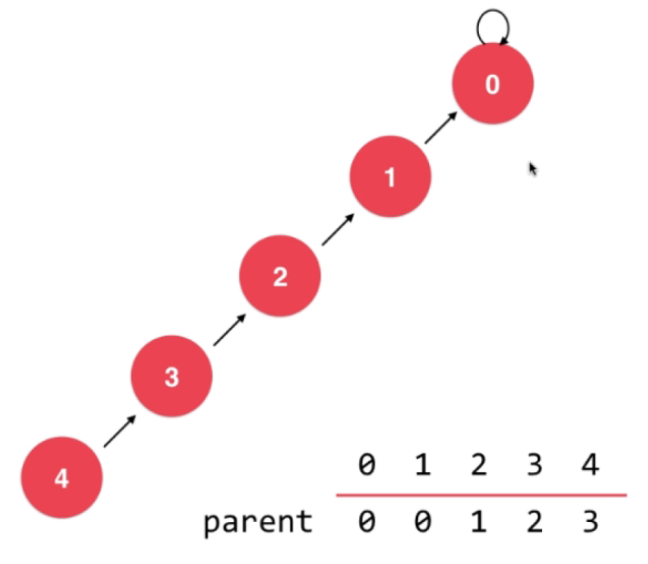
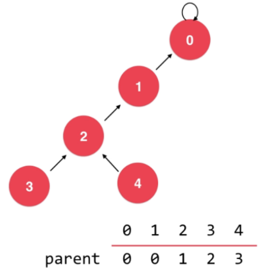
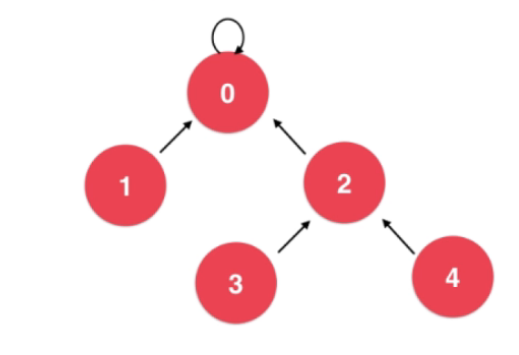

# 并查集

解决两个节点是否相连接的问题

使用树表示, 每个节点指向父节点,有相同的根节点即为相连接

1,2,3连接

5,6,7连接

如果7要和3连接,只需要将将7的根节点与3的根节点相连接

## 根据树的高度进行优化

根节点为7的树高度为2, 根节点为8的树高度为3

合并时将高度小的合并到高度大的集合中

## 路径压缩

在查找根节点的过程中将树的高度进行压缩

1. 寻找4的根节点, 首先看4的父节点是不是根节点, 不是就把4的父节点设置为4的父节点的父节点2

2. 接下来找到4的父节点2, 寻找2的根节点, 首先看2的父节点是不是根节点, 不是就把2的父节点设置为2的父节点的父节点0

3. 找到2的父节点0, 0是根节点, 找到了4的根节点0, 并完成了压缩
