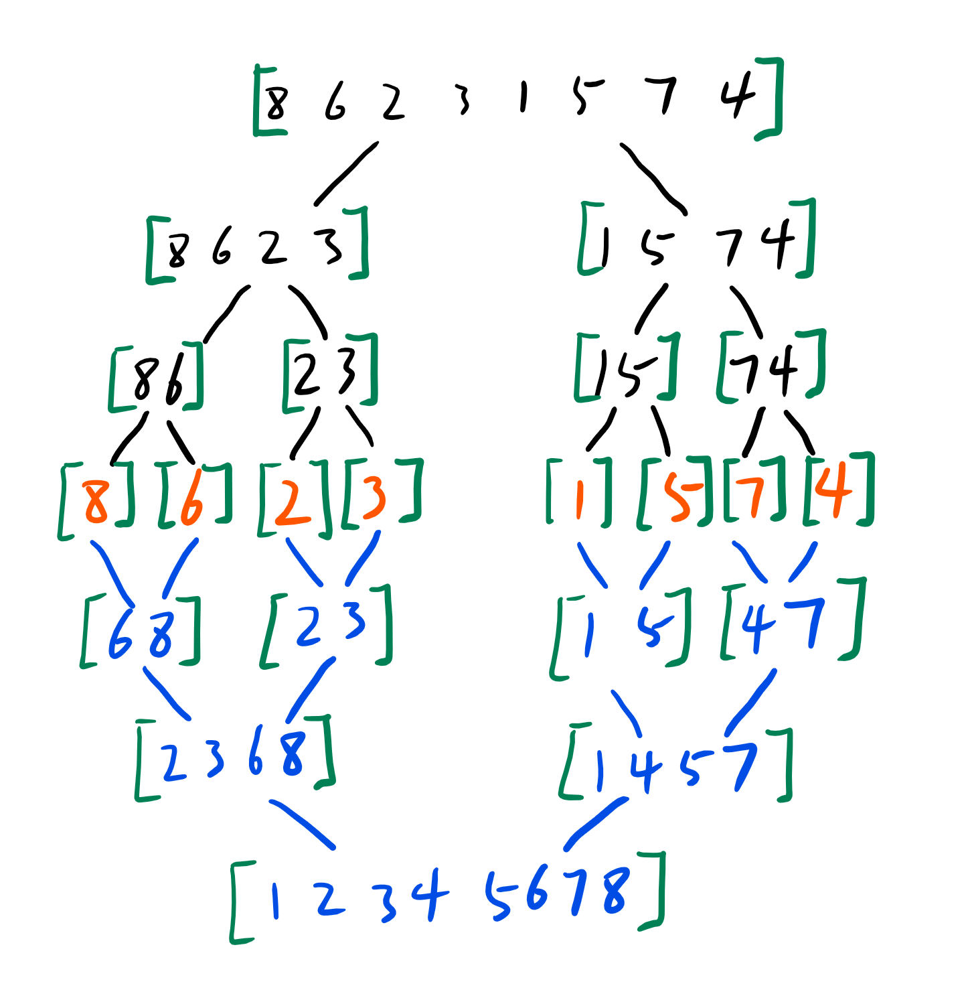

# 归并排序

将数组不断二分, 直到每个数组长度为1,
再将分开的数组不断合并, 在合并过程中排序, 是对树的深度优先遍历



## 合并过程

* 此时数组已经在逻辑上被分成了两部分: 左子数组`2 3 6 8`和右子数组`1 4 5 7`
* 创建数组的副本
* 建立索引i指向副本数组的元素2(2是左子数组的起始位置)
* 建立索引j指向副本数组的元素1(1是右子数组的起始位置)
* 建立索引k指向原始数组的元素2

* 比较i和j所指元素的大小, 由于j指向的元素小, 将j指向的元素1设置给k指向的元素, 并将j向后移动指向下一个元素4, k向后移动指向下一个元素3
```
此时原始数组: 1 3 6 8 1 4 5 7
此时副本数组: 2 3 6 8 1 4 5 7
```
* 继续比较i和j所指元素的大小, 这次i指向的元素小, 将i指向的元素2设置给k指向的元素, 并将i向后移动指向下一个元素3, k向后移动指向下一个元素6
```
此时原始数组: 1 2 6 8 1 4 5 7
此时副本数组: 2 3 6 8 1 4 5 7
```
* 以此类推

## 代码表示

```java
/**
 * 归并排序
 */
public void sort(Comparable[] array) {
    mergeSort(array, 0, array.length - 1);
}
/**
 * 将数组二分
 * 递归使用归并排序,对arr[l...r]的范围进行排序
 */
private static void mergeSort(Comparable[] arr, int l, int r) {
    if (l >= r) return;
    int mid = (l + r) / 2;
    mergeSort(arr, l, mid);
    mergeSort(arr, mid + 1, r);
    merge(arr, l, mid, r);
}
/**
 * 合并
 * 将arr[l...mid]和arr[mid+1...r]两部分进行归并
 */
private static void merge(Comparable[] arr, int l, int mid, int r) {
    Comparable[] aux = Arrays.copyOfRange(arr, l, r + 1);
    // 初始化, i指向左半部分的起始索引位置l
    // j指向右半部分起始索引位置mid + 1
    int i = l;
    int j = mid + 1;
    for (int k = l; k <= r; k++) {
        if (i > mid) {
            // 左半部分元素已经全部处理完毕
            arr[k] = aux[j - l];
            j++;
        } else if (j > r) {
            // 右半部分元素已经全部处理完毕
            arr[k] = aux[i - l];
            i++;
        } else if (aux[i - l].compareTo(aux[j - l]) < 0) {
            // 左半部分所指元素 < 右半部分所指元素
            arr[k] = aux[i - l];
            i++;
        } else {
            // 左半部分所指元素 >= 右半部分所指元素
            arr[k] = aux[j - l];
            j++;
        }
    }
}
```
