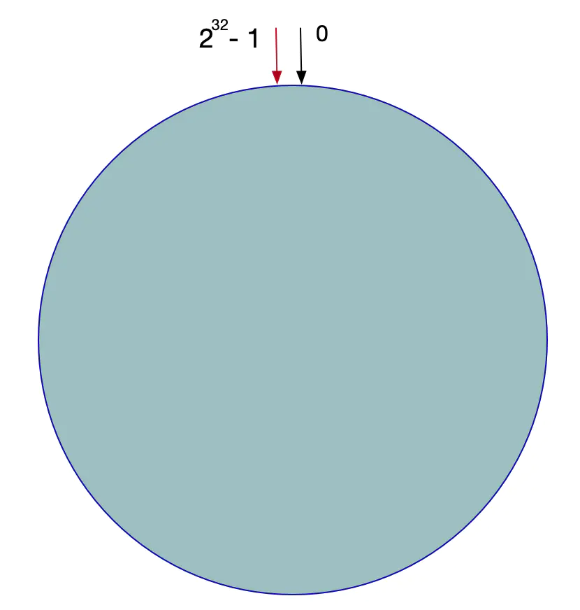

# 一致性Hash算法

一致性Hash算法也是使用取模的方法，不过，源地址hash算法的取模方法是对服务器的数量进行取模，而一致性的Hash算法是对2的32方取模。即，一致性Hash算法将整个Hash空间组织成一个虚拟的圆环，Hash函数的值空间为0 ~ 2^32 - 1(一个32位无符号整型)，整个哈希环如下：

整个圆环以顺时针方向组织，圆环正上方的点代表0，0点右侧的第一个点代表1，以此类推。

将各个服务器使用服务器的IP得到一个哈希值，这样每台服务器就确定在了哈希环的一个位置上，比如有三台机器，使用IP地址哈希后在环空间的位置：

将客户端ip使用相同的函数Hash计算出哈希值，并确定此数据在环上的位置，从此位置沿环顺时针查找，遇到的服务器就是其应该定位到的服务器。

例如，现在有ObjectA，ObjectB，ObjectC三个客户端，经过哈希计算后，在环空间上的位置如下：

假设Node C宕机了，则A、B不会受到影响，只有Object C对象被重新定位到Node A。所以在一致性Hash算法中，如果一台服务器不可用，受影响的仅仅是此服务器到其环空间前一台服务器之间的数据（这里为Node C到Node B之间的数据），其他不会受到影响。

假设增加了一台服务器Node X，此时对象ObjectA、ObjectB没有受到影响，只有Object C重新定位到了新的节点X上。

