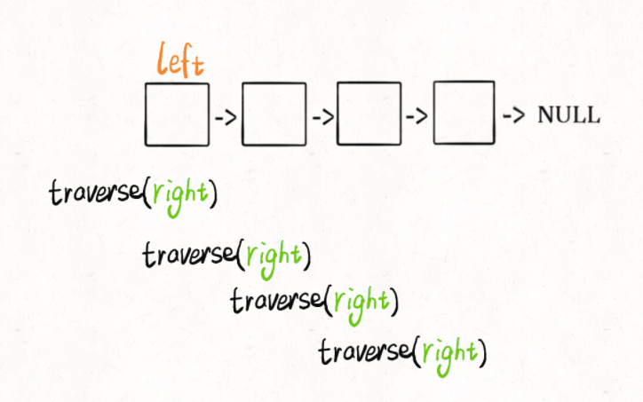
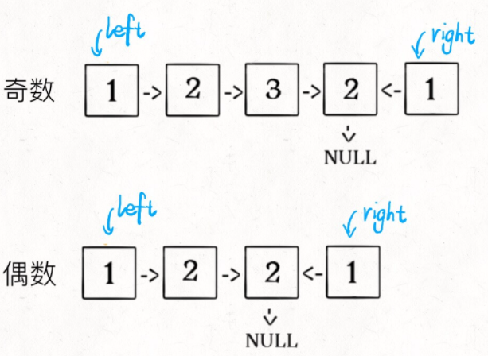

# 判断回文单链表

输入一个单链表的头结点，判断这个链表中的数字是不是回文

思路: 把原始链表反转存入一条新的链表，然后比较这两条链表是否相同。

# 链表后序遍历

```java
void traverse(ListNode head) {
    // 前序遍历代码
    traverse(head.next);
    // 后序遍历代码
}
```

用后序遍历实现倒序遍历链表

```java
/* 倒序打印单链表中的元素值 */
void traverse(ListNode head) {
    if (head == null) return;
    traverse(head.next);
    // 后序遍历代码
    print(head.val);
}
```

# 实现回文判断

```java
// 左侧指针
ListNode left;

boolean isPalindrome(ListNode head) {
    left = head;
    return traverse(head);
}

boolean traverse(ListNode right) {
    if (right == null) return true;
    boolean res = traverse(right.next);
    // 后序遍历代码
    res = res && (right.val == left.val);
    left = left.next;
    return res;
}
```



# 优化空间复杂度

1. 先通过快慢指针来找到链表的中点
2. 如果链表长度为奇数，则中位数不需要判断，slow还要再前进一步
3. 从slow开始反转后面的链表，现在就可以开始比较回文串了

```java
ListNode slow, fast;
slow = fast = head;
while (fast != null && fast.next != null) {
    slow = slow.next;
    fast = fast.next.next;
}

if (fast != null)
    slow = slow.next;

ListNode left = head;
ListNode right = reverse(slow);

while (right != null) {
    if (left.val != right.val)
        return false;
    left = left.next;
    right = right.next;
}
return true;
```


