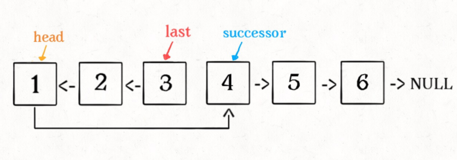
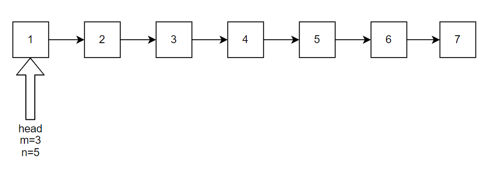
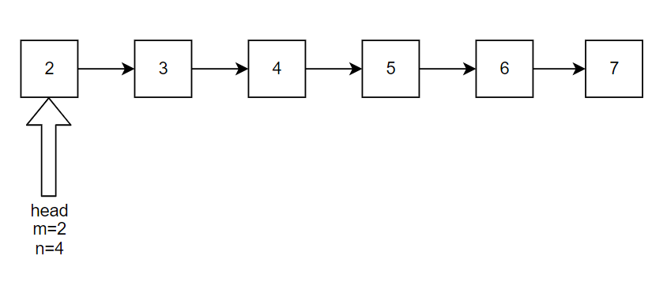

# 反转整个链表

```java
ListNode reverse(ListNode head) {
    // base case, 
    // 如果链表只有一个节点的时候反转也是它自己，
    // 直接返回即可。
    if (head.next == null) return head;
    // 设head后面的节点都已经反转完了
    ListNode last = reverse(head.next);
    // 反转head
    // 1→2 变成 1←2
    head.next.next = head;
    head.next = null;
    return last;
}
```

# 执行过程

```
1 → 2 → 3 → 4 → 5
⬆
head
```

reverse(head.next)
```
1 → 2 ← 3 ← 4 ← 5
⬆               ⬆
head            last
```

head.next.next = head;
```
1 ⇄ 2 ← 3 ← 4 ← 5
⬆               ⬆
head            last
```

head.next = null;
```
1 ← 2 ← 3 ← 4 ← 5
⬆               ⬆
head            last
```

# 反转链表前 N 个节点

```java
// 不用反转的节点
ListNode successor = null;

// 反转以 head 为起点的 n 个节点，返回新的头结点
ListNode reverseN(ListNode head, int n) {
    if (n == 1) { 
        // n=1时不需要继续反转
        successor = head.next;
        return head;
    }
    // 以 head.next 为起点，需要反转前 n - 1 个节点
    ListNode last = reverseN(head.next, n - 1);

    head.next.next = head;
    // 让反转之后的 head 节点和后面的节点连起来
    head.next = successor;
    return last;
}
```



# 反转链表的一部分

给一个索引区间 `[m,n]`（索引从 1 开始），仅仅反转区间中的链表元素。

首先，如果 m == 1，就相当于反转链表前 N 个节点

如果 m != 1 , 就把 head 指针不断后移，直到m为1为止
```java
ListNode reverseBetween(ListNode head, int m, int n) {
    // base case
    if (m == 1) {
        return reverseN(head, n);
    }
    // 前进到反转的起点触发 base case
    head.next = reverseBetween(head.next, m - 1, n - 1);
    return head;
}
```






